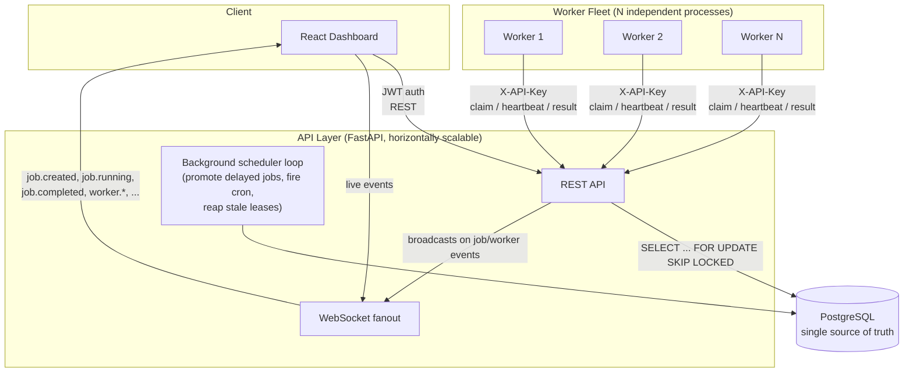

# Architecture

## System diagram

## Why the database is the coordinator, not a message broker

The spec asks for atomic claiming, retries, DLQ, heartbeats, and a
relational schema for essentially everything. Rather than bolting Postgres
onto a Redis/RabbitMQ queue (two sources of truth to keep consistent, two
failure modes to reason about), the whole system uses Postgres as both the
system of record *and* the work queue, coordinated with
`SELECT ... FOR UPDATE SKIP LOCKED`. This is the same pattern used in
production by things like GoodJob (Rails), pg-boss (Node), and river (Go):
it trades a bit of raw throughput ceiling (a dedicated broker will always
out-scale a relational table as a queue) for a hugely simpler operational
story and exactly-once claiming with zero extra infrastructure. See
`DESIGN_DECISIONS.md` for the throughput ceiling this implies and when
you'd actually want to graduate off of it.

## Request flow: submitting and running a job

1. Caller (via API key) `POST /projects/{id}/queues/{qid}/jobs`. If
   `run_at`/`delay_seconds` is in the future, the job lands as `SCHEDULED`;
   otherwise `QUEUED` immediately.
2. The background scheduler loop (one asyncio task per API process) ticks
   every second: promotes due `SCHEDULED` jobs to `QUEUED`, materializes any
   due cron `ScheduledJob` templates into new `Job` rows, and reaps jobs
   whose worker lease expired (crash recovery).
3. A worker process polls `POST /workers/{id}/claim` with the queues it
   watches and how many slots it has free. The API locks and returns up to
   that many `QUEUED` jobs, respecting queue concurrency limits, per-queue
   rate limits, and workflow dependencies (`depends_on_job_id`) — all in one
   transaction per queue, guarded by both a DB-level lock (`FOR UPDATE SKIP
   LOCKED`, safe across processes) and an in-process `asyncio.Lock` keyed by
   queue id (closes a race between coroutines within one API process; see
   `DESIGN_DECISIONS.md`).
4. The worker calls `POST /jobs/{id}/start` (→ `RUNNING`, opens a
   `JobExecution` row), runs the handler for `job_type`, then reports
   `POST /jobs/{id}/result`.
5. On success → `COMPLETED`. On failure → if attempts remain, backoff is
   computed from the job's (or queue's default) `RetryPolicy` and the job
   goes back to `QUEUED` with a future `run_at`; once attempts are
   exhausted, the job moves to `DEAD_LETTER` and a `DeadLetterEntry` row is
   written with a payload snapshot.
6. Every transition broadcasts a WebSocket event to dashboard clients
   subscribed to that project, so the UI updates without polling (polling
   is still used as a fallback/refresh, since WS fanout is in-process —
   see limitations).

## Failure & recovery paths

- **Worker crashes mid-job**: its lease (`lease_expires_at`) isn't renewed.
  The reaper (part of the scheduler loop) notices the expired lease and
  either requeues the job (attempts remain) or dead-letters it — the job is
  never silently lost.
- **API process restarts**: no in-memory state to lose; the DB is the only
  source of truth. In-flight jobs' leases still expire and get reaped
  normally.
- **Worker asked to shut down (SIGTERM)**: stops claiming, calls `/drain` so
  the dashboard shows it draining, finishes in-flight work up to a timeout,
  deregisters.

## Scaling model

- **API**: stateless except the in-process scheduler loop and WebSocket
  connection table — see `DESIGN_DECISIONS.md` for what that costs at >1
  replica.
- **Workers**: fully horizontal. Add more processes, point them at more
  queues or the same ones; the claim query is what keeps them from
  double-processing.
- **Database**: the eventual bottleneck. The claim query is indexed
  (`ix_jobs_claim_scan` on `(queue_id, status, run_at)`) and touches at most
  `max_jobs` rows per call, so it stays cheap well past the point most
  projects need it — but see the throughput note in `DESIGN_DECISIONS.md`.
